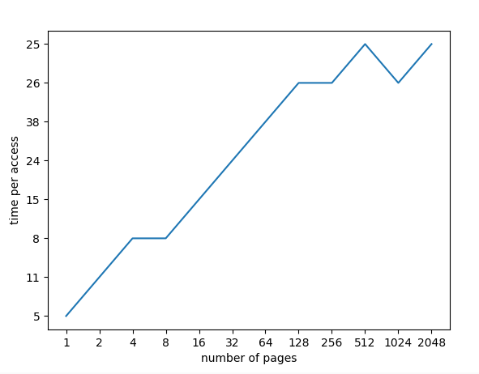

<br/>
<br/>

1.为了计时,可能需要一个计时器,(例如`gettimeofday`)。这种计时器的精度如何?操作要花多少时间,才能让你对它精确计时?(这有助于确定需要循环多少次,反复访问内存页,才能对它成功计时。)

`gettimeofday` 精度为微秒级,成本也为微秒级([参考](https://blog.csdn.net/russell_tao/article/details/7185588))
`rdtsc`指令,成本与精确度都是纳秒级(取决于 cpu 使用周期)

测试方法参考[How to Benchmark Code Execution Times on Intel® IA-32 and IA-64 Instruction Set Architectures](https://www.intel.com/content/dam/www/public/us/en/documents/white-papers/ia-32-ia-64-benchmark-code-execution-paper.pdf)


<br/>
<br/>

2.写一个程序,命名为 tlb.c,大体测算一下每个页的平均访问时间。程序的输入参数有:页的数目和尝试的次数。

```shell script
gcc tlb.c && ./a.out -l 15 -p 15
```
l 参数为测试次数,p 参数为页数

<br/>
<br/>

3.用你喜欢的脚本语言(csh、 Python 等写一段脚本来运行这个程序,当访问页面从 1 增长到几千,也许每次迭代都乘 2。在不同的机器上运行这段脚本,同时收集相应数据。需要试多少次才能获得可信的测量结果?

```shell script
python3 run.py
```

<br/>
<br/>

4.接下来,将结果绘图,类似于上图。可以用 ploticus 这样的好工具画图。可视化使数据更容易理解,你认为是什么原因?

```shell script
bash run.sh
```

)

<br/>
<br/>

5.要注意编译器优化带来的影响。编译器做各种聪明的事情,包括优化掉循环,如果循环中增加的变量后续没有使用。如何确保编译器不优化掉你写的 TLB 大小测算程序的主循环?

> gcc 选项-O 启用不同级别的优化。使用-O0(默认)禁用它们。-O3 是最高级别的优化。

<br/>
<br/>

6.还有一个需要注意的地方,今天的计算机系统大多有多个 CPU,每个 CPU 当然有自己的 TLB 结构。为了得到准确的测量数据我们需要只在一个 CPU 上运行程序,避免调度器把进程从一个 CPU 调度到另一个去运行。如何做到?(提示:在 Google 上搜索“ pinningthread”相关的信息)如果没有这样做,代码从一个 CPU 移到了另一个,会发生什么情况?

<pre>
pthread_setaffinity_np
</pre>
切换 cpu 时成本增加,但时使用新的小 TLB 使速度变快

<br/>
<br/>

7.另一个可能发生的问题与初始化有关。如果在访问数组 a 之前没有初始化,第一次访问将非常耗时,由于初始访问开销,比如要求置 0。这会影响你的代码及其计时吗?如何抵消这些潜在的开销?

不会,没有初始化,且计时器不会记录初始化的时间