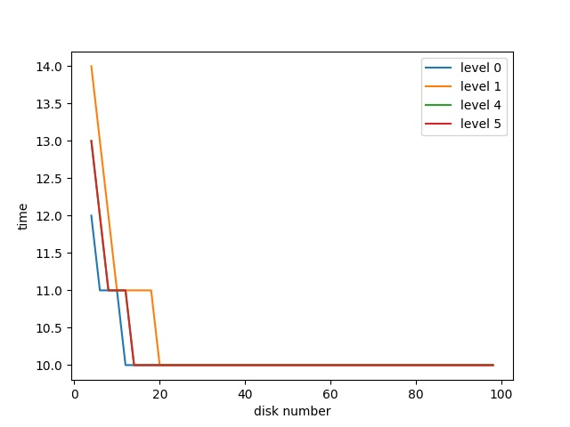

作业

本节引入 raid.py，这是一个简单的 RAID 模拟器，你可以使用它来增强你对 RAID 系统工作方式的了解。
详情请参阅 README 文件。

问题

<br/>
<br/>

1.使用模拟器执行一些基本的 RAID 映射测试。运行不同的级别（0、1、4、5），看看你是否可以找出一组请求的映射。
对于 RAID-5，看看你是否可以找出左对称（left- symmetric）和左不对称（left-asymmetric）布局之间的区别。
使用一些不同的随机种子，产生不同于上面的问题。

<pre>
❯ python2 raid.py -n 10 -L 5 -5 LS -c -W seq

LOGICAL READ from addr:0 size:4096
  read  [disk 0, offset 0]   
LOGICAL READ from addr:1 size:4096
  read  [disk 1, offset 0]   
LOGICAL READ from addr:2 size:4096
  read  [disk 2, offset 0]   
LOGICAL READ from addr:3 size:4096
  read  [disk 3, offset 1]   
LOGICAL READ from addr:4 size:4096
  read  [disk 0, offset 1]   
LOGICAL READ from addr:5 size:4096
  read  [disk 1, offset 1]   
LOGICAL READ from addr:6 size:4096
  read  [disk 2, offset 2]   
LOGICAL READ from addr:7 size:4096
  read  [disk 3, offset 2]   
LOGICAL READ from addr:8 size:4096
  read  [disk 0, offset 2]   
LOGICAL READ from addr:9 size:4096
  read  [disk 1, offset 3]  

❯ python2 raid.py -n 10 -L 5 -5 LA -c -W seq

LOGICAL READ from addr:0 size:4096
  read  [disk 0, offset 0]   
LOGICAL READ from addr:1 size:4096
  read  [disk 1, offset 0]   
LOGICAL READ from addr:2 size:4096
  read  [disk 2, offset 0]   
LOGICAL READ from addr:3 size:4096
  read  [disk 0, offset 1]   
LOGICAL READ from addr:4 size:4096
  read  [disk 1, offset 1]   
LOGICAL READ from addr:5 size:4096
  read  [disk 3, offset 1]   
LOGICAL READ from addr:6 size:4096
  read  [disk 0, offset 2]   
LOGICAL READ from addr:7 size:4096
  read  [disk 2, offset 2]   
LOGICAL READ from addr:8 size:4096
  read  [disk 3, offset 2]   
LOGICAL READ from addr:9 size:4096
  read  [disk 1, offset 3] 
</pre>

从上面读取的磁盘与偏移可以推测 left- symmetric）和 left-asymmetric 的物理磁盘布局：
<pre>
left-symmetric      left-asymmetric
0  1  2  P          0  1  2  P
4  5  P  3          3  4  P  5
8  P  6  7          6  P  7  8
</pre>
 

<br/>
<br/>

2.与第一个问题一样，但这次使用 -C 来改变块的大小。大块的大小如何改变映射？

<pre>
❯ python2 raid.py -n 20 -L 5 -5 LS -c -W seq -C 8K
...
LOGICAL READ from addr:0 size:4096
  read  [disk 0, offset 0]   
LOGICAL READ from addr:1 size:4096
  read  [disk 0, offset 1]   
LOGICAL READ from addr:2 size:4096
  read  [disk 1, offset 0]   
LOGICAL READ from addr:3 size:4096
  read  [disk 1, offset 1]   
LOGICAL READ from addr:4 size:4096
  read  [disk 2, offset 0]   
LOGICAL READ from addr:5 size:4096
  read  [disk 2, offset 1]   
LOGICAL READ from addr:6 size:4096
  read  [disk 3, offset 2]   
LOGICAL READ from addr:7 size:4096
  read  [disk 3, offset 3]   
LOGICAL READ from addr:8 size:4096
  read  [disk 0, offset 2]   
LOGICAL READ from addr:9 size:4096
  read  [disk 0, offset 3]  
... 
</pre>

布局推测：
<pre>
0  2  4  P
1  3  5  P
8  10 P  6
9  11 P  7
</pre>

<br/>
<br/>

3.执行上述测试，但使用 r 标志来反转每个问题的性质。

<pre>
❯ python2 raid.py -n 12 -L 5 -5 LS -c -W seq -C 8K -r
LOGICAL READ from addr:0 size:4096
  read  [disk 0, offset 0]   
LOGICAL READ from addr:1 size:4096
  read  [disk 0, offset 1]   
LOGICAL READ from addr:2 size:4096
  read  [disk 1, offset 0]   
LOGICAL READ from addr:3 size:4096
  read  [disk 1, offset 1]   
LOGICAL READ from addr:4 size:4096
  read  [disk 2, offset 0]   
LOGICAL READ from addr:5 size:4096
  read  [disk 2, offset 1]   
LOGICAL READ from addr:6 size:4096
  read  [disk 3, offset 2]   
LOGICAL READ from addr:7 size:4096
  read  [disk 3, offset 3]   
LOGICAL READ from addr:8 size:4096
  read  [disk 0, offset 2]   
LOGICAL READ from addr:9 size:4096
  read  [disk 0, offset 3]   
LOGICAL READ from addr:10 size:4096
  read  [disk 1, offset 2] 
LOGICAL READ from addr:11 size:4096
  read  [disk 1, offset 3] 
</pre>

<br/>
<br/>

4.现在使用反转标志，但用-S 标志增加每个请求的大小。尝试指定 8 KB、12 KB 和 16 KB 的大小，同时改变 RAID 级别。
当请求的大小增加时，底层 IO 模式会发生什么？请务必在顺序工作负载上尝试此操作（-W sequential）。
对于什么请求大小，RAID-4 和 RAID-5 的 I0 效率更高？

当请求块大小超过磁盘块大小时，一个请求需要读写多个磁盘

对于 RAID-4 和 RAID-5，请求块大小为 16 K 时，效率更高，因为可以同时利用多个磁盘，相当于全条带写入（见书 P335 页）

```shell script
python2 raid.py -n 12 -L 4 -W seq -S 8K -r -c 
python2 raid.py -n 12 -L 4 -W seq -S 12K -r -c
python2 raid.py -n 12 -L 4 -W seq -S 16K -r -c

python2 raid.py -n 12 -L 5 -W seq -S 8K -r -c 
python2 raid.py -n 12 -L 5 -W seq -S 12K -r -c
python2 raid.py -n 12 -L 5 -W seq -S 16K -r -c
```

<br/>
<br/>

5.使用模拟器的定时模式（-t）来估计 100 次随机读取到 RAID 的性能，同时改变 RAID 级别，使用 4 个磁盘。

```shell script
python2 raid.py -L 0 -t -n 100 -c -D 4 # 275.7
python2 raid.py -L 1 -t -n 100 -c -D 4 # 278.7
python2 raid.py -L 4 -t -n 100 -c -D 4 # 386.1
python2 raid.py -L 5 -t -n 100 -c -D 4 # 276.7
```

<br/>
<br/>

6.按照上述步骤操作，但增加磁盘数量。随着磁盘数量的增加，每个 RAID 级别的性能如何变化？


```shell script
python3 plot.py -p plot.jpg# 生成图片
```

<br/>
<br/>

7.执行上述操作，但全部用写入（-w 100），而不是读取。每个 RAID 级别的性能现在如何扩展你能否粗略估计完成 100 次随机写入所需的时间？


```shell script
python3 plot.py -w 100 -p plot-write.jpg # 生成图片
```

<br/>
<br/>

8.最后一次运行定时模式，但是这次用顺序的工作负载（-W sequential）性能如何随 RAID 级别而变化，在读取与写入时有何不同？
如何改变每个请求的大小？使用 RAID-4 或 RAID-5 时应该写入 RAID 大小是多少？





```shell script
python3 plot.py -w 100 -W seq -p plot-write-seq.jpg 
python3 plot.py -W seq -p plot-read-seq.jpg 
```

使用 RAID-4 或 RAID-5 时写入大小应该为 可用磁盘数×磁盘块大小（相当于全条带写入）